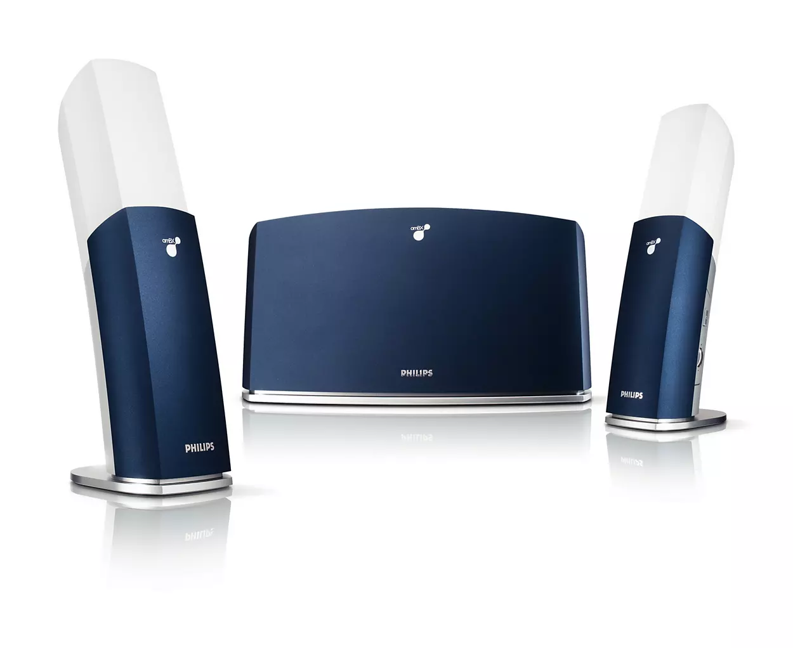

# amBX
Node.JS wrapper for AMBX's and Philips' gaming lights.


*© Koninklijke Philips N.V. All image rights reserved*

# Installation & Requirements
Install using [NPM](https://www.npmjs.com/package/amBX) (adding to registry soon)
```console
npm i amBX
```

This package uses [node-usb](https://github.com/node-usb/node-usb), make sure to have libusb installed.

# Getting Started
To create a new instance, use
```js
import { CreateDevice, Lights } from "amBX"

(async () => {
  try {
    // Create instance. Will throw if no amBX device is found
    const myAMBX = await CreateDevice();
    // Set the center wallwasher to red
    await myAMBX.SetColor(Lights.WallCenter, 255, 0, 0);
  } catch (e) {
    console.log("Something went wrong:", e);
  }
})();
```

# Methods
tbd
